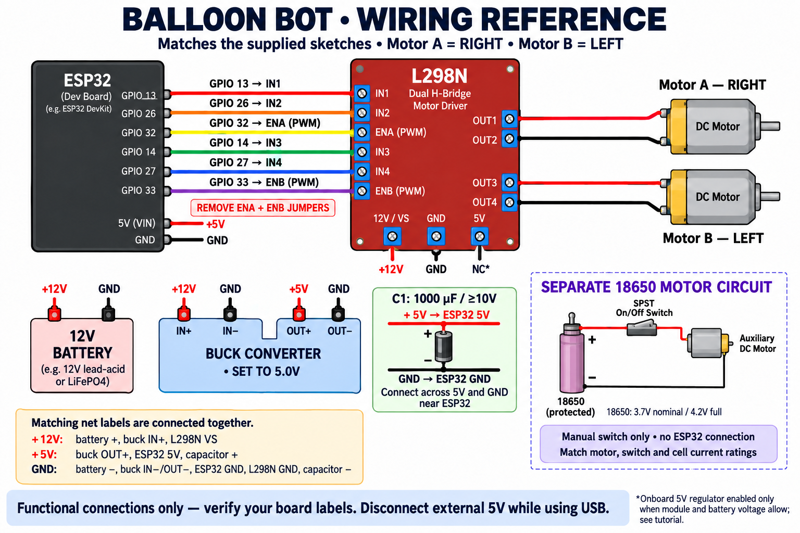

# Balloon Bot Tutorial

An ESP32 robot controlled by a Bluetooth gamepad using Bluepad32 and an L298N dual motor driver. This project includes Shreyas S Rai's original controller sketches, code-training video, demo, CAD files, and an illustrated wiring guide.

## Start here

1. Read the [assembly and wiring tutorial](docs/TUTORIAL.md).
2. Watch the [original code-training video](Ballon%20bot%20Code%20training%20.mov).
3. Choose [single-stick arcade control](SingleStickctrl/SingleStickctrl.ino) or [two-stick tank control](TankdrvCtrl/TankdrvCtrl.ino).
4. Use the [CAD files](Ballon%20BotCAD%20/) for the mechanical parts.

**The diagram follows the supplied code: Motor A is RIGHT; Motor B is LEFT.** The original written wiring notes called A left and B right. GPIO assignments are unchanged; this guide resolves the wheel labels using both sketches.

The power section uses net labels: every main-circuit terminal marked `+12V` is connected together, likewise `+5V` and `GND`. The three nets remain separate. The boxed 18650 circuit is electrically independent.

## Project files

| File / folder | Purpose |
| --- | --- |
| `SingleStickctrl/SingleStickctrl.ino` | Left-stick throttle and steering, mixed into two motor outputs |
| `TankdrvCtrl/TankdrvCtrl.ino` | Right stick controls Motor A; left stick controls Motor B |
| `Ballon bot Code training .mov` | Original tutorial recording |
| `Demo Ballon bot .mp4` | Original robot demo recording |
| `Ballon BotCAD /` | Original STL/DXF parts and duplicate copies of the sketches |
| `docs/TUTORIAL.md` | Parts, wiring, power, upload, controls, and checks |
| `docs/images/balloon-bot-wiring.png` | Updated wiring reference generated with the built-in image tool |
| `docs/images/wiring-image-prompt.txt` | Initial image-generation prompt |
| `docs/images/wiring-image-edit-prompt.txt` | Correction prompt used for the final image |

## Before powering on

- Remove the L298N **ENA and ENB** jumpers for GPIO PWM control.
- Set the buck converter to **5.0V** before connecting the ESP32.
- Fit a **1000 µF electrolytic capacitor, rated 10V or higher, across 5V and GND** near the ESP32: `+` to 5V, `−` to GND.
- Join ESP32, driver, buck, and main-battery grounds. Leave the separate 18650 circuit isolated.
- The L298N's **5V regulator jumper is different from ENA/ENB**. Leaving its 5V terminal disconnected requires the onboard regulator to be enabled and suitable for the actual battery voltage; read the tutorial first.

The sketches are preserved as supplied. Their 300 ms timeout does **not** reliably detect stale controller packets while Bluetooth remains connected; see the [code behavior and limitation](docs/TUTORIAL.md#code-behavior-and-limitation) before testing.
